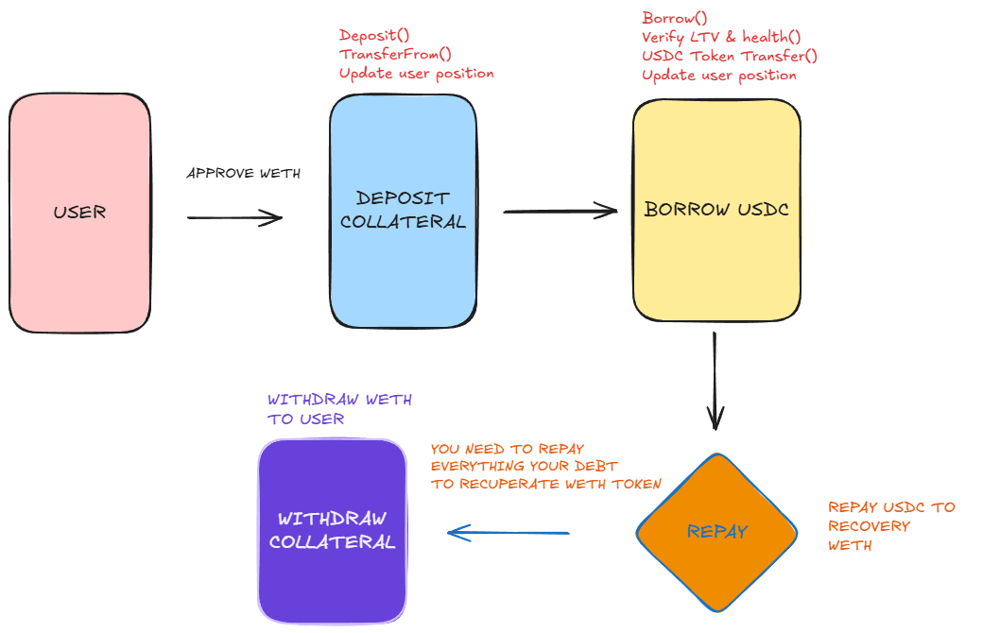
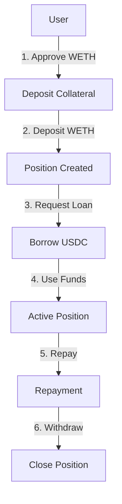

# 🏦 Lending/Borrowing Protocol



A decentralized lending and collateralization protocol based on WETH and USDC, leveraging Uniswap v3 TWAP as a price oracle for secure and reliable price feeds.

## ✨ Features

- 🔒 WETH deposits as collateral with secure vault system
- 💰 USDC loans with maximum 75% LTV ratio
- ⚡ Liquidation system with 5% bonus for liquidators
- 📊 Uniswap v3 TWAP oracle for accurate price feeds
- 📈 Fixed 3% APR interest rate
- 🛡️ Reentrancy protection
- 🔄 Automatic interest accrual
- 📱 User-friendly position management

## 🏗️ Architecture

### 📝 Smart Contracts

- `UniswapTwapOracle.sol`: Price oracle based on Uniswap v3 TWAP
- `LendingPool.sol`: Main lending/borrowing contract with position management

### 🔄 User Flow



1. **Deposit** 💰
   - User approves WETH for the protocol
   - User deposits WETH as collateral
   - System creates a new position

2. **Borrow** 💳
   - User requests USDC loan
   - System verifies maximum LTV (75%)
   - Funds are transferred to user

3. **Repayment** 🔄
   - User repays USDC plus interest
   - System updates position
   - Interest is automatically accrued

4. **Withdraw** 📤
   - User withdraws WETH while maintaining safe LTV
   - System verifies health factor
   - Position is updated

5. **Liquidation** ⚡
   - Liquidator repays debt
   - Receives collateral + 5% bonus
   - Position is closed

## 🛠️ Development

### 📋 Requirements

- Foundry
- Solidity 0.8.26
- Node.js

### 🚀 Installation

```bash
# Clone repository
git clone https://github.com/your-username/lending-protocol.git
cd lending-protocol

# Install dependencies
forge install

# Compile contracts
forge build
```

## 🔒 Security

- Internal audit
- Comprehensive testing
- Price validations
- Oracle heartbeat system
- Price change limits
- Reentrancy protection
- Access control
- Emergency pause functionality

## 📊 Protocol Parameters

| Parameter | Value | Description |
|-----------|-------|-------------|
| Max LTV | 75% | Maximum loan-to-value ratio |
| Liquidation Threshold | 80% | Threshold for liquidation |
| Liquidation Bonus | 5% | Bonus for liquidators |
| Interest Rate | 3% APR | Fixed annual interest rate |
| Max Collateral | 1000 WETH | Maximum collateral per user |
| Max Debt | 400k USDC | Maximum debt per user |

## 🤝 Contributing

We welcome contributions! Please feel free to submit a Pull Request.

## 📄 License

MIT
